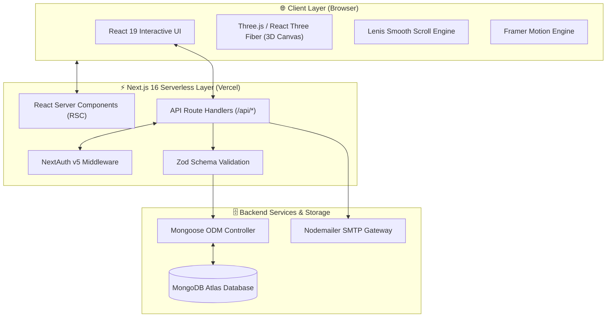
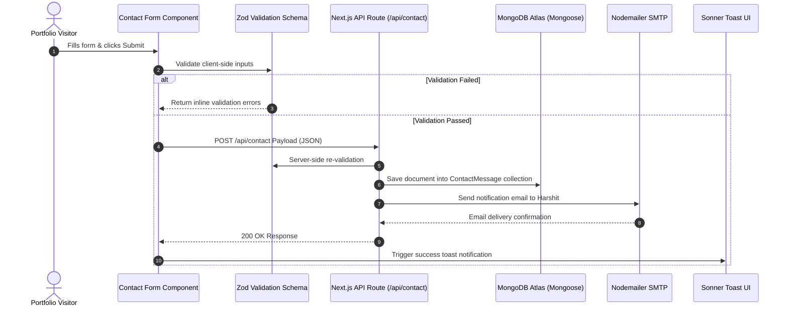
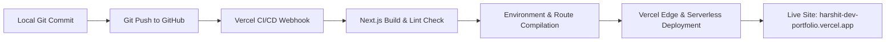

# 🏗️ System Architecture & Design Document

## Project Name: Harshit Developer Portfolio
**Version:** 1.0.0  
**Stack:** Next.js 16 (App Router) | React 19 | TypeScript | Tailwind CSS v4 | Three.js | MongoDB | NextAuth v5  
**Document Status:** Active / Production  

---

## 1. High-Level Architecture Overview

The **Harshit Developer Portfolio** follows a modern **Full-Stack Jamstack + Serverless API Architecture** built on top of the **Next.js 16 App Router**. 

The system segregates concerns into three major layers:
1. **Presentation & Interactive Layer (Client Browser):** React 19 Client Components, Three.js 3D WebGL Canvas, Framer Motion micro-interactions, and Lenis smooth scrolling.
2. **Application & API Layer (Next.js Serverless):** React Server Components (RSC), Next.js API Route Controllers, NextAuth Middleware authentication, and Zod data validation.
3. **Data & Infrastructure Layer (Cloud Services):** MongoDB Atlas database accessed via Mongoose ODM, Nodemailer SMTP server for email dispatch, and Vercel Edge/Serverless deployment platform.

---

## 2. System Architecture Diagram



---

## 3. Layer Breakdown & Technical Details

### 3.1 Presentation Layer (Frontend)
- **React 19 & Next.js App Router:** Employs Server Components by default to send zero JS runtime for static sections, hydrating interactive islands (e.g., 3D canvas, forms, filter buttons) with `"use client"`.
- **3D Graphics Pipeline:** `@react-three/fiber` and `@react-three/drei` render WebGL shaders and 3D geometries within isolated canvas viewports. Loaded dynamically via `next/dynamic` with `ssr: false` to avoid blocking core Web Vitals.
- **Micro-Animations & Smooth Scrolling:** `framer-motion` manages scroll-triggered animations and modal transitions, while `lenis` normalizes mouse wheel inertia scrolling across all operating systems.
- **Design System:** Tailwind CSS v4 utility classes paired with `next-themes` for zero-flash light/dark theme switching.

### 3.2 Application & API Layer (Backend)
- **Route Handlers:** Next.js `/src/app/api/` route handlers process RESTful requests (GET, POST, PUT, DELETE).
- **Authentication & Authorization:** Powered by `NextAuth.js v5`. Secures sensitive endpoints (e.g., `/api/messages`, `/api/dashboard`) using JSON Web Tokens (JWT) and `@auth/mongodb-adapter`. Passwords are encrypted using `bcryptjs` with high salt rounds.
- **Data Validation:** Incoming request bodies are validated against `zod` schemas prior to database execution.

### 3.3 Data & Storage Layer (Database)
- **MongoDB Atlas & Mongoose ODM:** Persistent document-oriented storage with strict schema models defined under `src/models/`.
- **Connection Management:** Cached Mongoose connection instance (`src/lib/db.ts`) prevents connection pool exhaustion in serverless function environments.
- **Seeding Engine:** Automated CLI script (`scripts/seed.ts`) reads static JSON definitions (`data/seed.json` / `seed.json`) and populates the MongoDB collections with initial portfolio data.

---

## 4. Directory & Module Topology

```
harshit-dev-portfolio/
├── .env.example            # Template for environment variables
├── data/                   # Initial JSON seed data
├── public/                 # Static assets, resume PDF, favicon & graphics
├── scripts/                # Utility scripts (seed.ts)
├── src/
│   ├── app/                # Next.js App Router
│   │   ├── api/            # API Route handlers (/api/contact, /api/projects, etc.)
│   │   ├── admin/          # Secured Admin Management pages
│   │   ├── layout.tsx      # Root Layout with Theme & Session Providers
│   │   └── page.tsx        # Portfolio Home Page
│   ├── components/         # React Components
│   │   ├── 3d/             # Three.js canvas & WebGL elements
│   │   ├── sections/       # Hero, About, Projects, Experience, Contact sections
│   │   ├── ui/             # Reusable UI primitives (Buttons, Cards, Modals)
│   │   └── theme-provider/ # Next-themes setup
│   ├── hooks/              # Custom React hooks (usePortfolio, useAuth)
│   ├── lib/                # Utility functions, DB connection, Mailer setup
│   ├── models/             # Mongoose DB Schemas
│   │   ├── User.ts
│   │   ├── Profile.ts
│   │   ├── Project.ts
│   │   ├── Experience.ts
│   │   ├── Education.ts
│   │   ├── Skill.ts
│   │   ├── Certificate.ts
│   │   ├── ContactMessage.ts
│   │   ├── Resume.ts
│   │   ├── Blog.ts
│   │   └── JobPost.ts
│   └── types/              # TypeScript interface definitions
└── tsconfig.json
```

---

## 5. Component Data Flow Architecture

### Contact Form Submission Flow



---

## 6. Security Architecture & Threat Mitigation

| Security Feature | Implementation Mechanism | Threat Mitigated |
|---|---|---|
| **Authentication** | NextAuth v5 Credentials Provider + JWT | Unauthorized admin route access |
| **Password Hashing** | BcryptJS encryption with salt rounds | Database leak / plaintext password exposure |
| **Payload Validation** | Zod server-side schemas | NoSQL injection & malformed payload attacks |
| **Secrets Management** | `.env.local` & Vercel Environment Variables | Credential leakage in public repos |
| **Database Connection** | Cached singleton connection pool (`db.ts`) | Serverless connection exhaustion / DDoS |
| **CORS & Headers** | Next.js automatic security headers | Cross-site scripting (XSS) & Clickjacking |

---

## 7. Deployment Pipeline (CI/CD)



1. **Version Control:** Managed via GitHub repository `harshit-1318/harshit-dev-portfolio`.
2. **Build Verification:** Vercel automatically runs `next build` to verify TypeScript compilation and ESLint rules.
3. **Edge Asset Delivery:** Static assets and cached RSC payloads served via Vercel CDN.

---

## 8. Summary & Repository Guidance

> **Should `architecture.md` be pushed to GitHub?**  
> **Yes, absolutely!** Adding an `architecture.md` file to your GitHub repository demonstrates **strong system design capability, clear technical documentation, and professional engineering standards**. It gives tech leads and recruiters immediate confidence in your architectural understanding.
