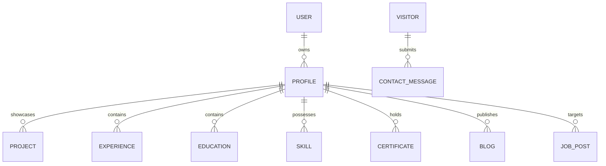

# 🗄️ Database Architecture & Schema Documentation

## Project Name: Harshit Developer Portfolio
**Database Engine:** MongoDB Atlas  
**ODM:** Mongoose v9  
**Connection Handler:** Cached Singleton Connection (`src/lib/db.ts`)  
**Seeding Engine:** CLI Tool (`scripts/seed.ts` via `npm run seed`)  

---

## 1. Entity-Relationship (ER) Diagram



---

## 2. Collection Schemas Breakdown

### 2.1 User (`src/models/User.ts`)
- `_id`: ObjectId
- `name`: String (Required)
- `email`: String (Required, Unique, Lowercase)
- `password`: String (Required, Encrypted via BcryptJS)
- `role`: String (Enum: `admin`, `user`, Default: `admin`)
- `createdAt`, `updatedAt`: Timestamps

### 2.2 Profile (`src/models/Profile.ts`)
- `_id`: ObjectId
- `name`: String (Required)
- `title`: String (Required)
- `bio`: String
- `location`: String
- `email`: String
- `githubUrl`, `linkedinUrl`, `twitterUrl`: String (URLs)
- `avatarUrl`: String
- `resumeUrl`: String
- `createdAt`, `updatedAt`: Timestamps

### 2.3 Project (`src/models/Project.ts`)
- `_id`: ObjectId
- `title`: String (Required)
- `slug`: String (Required, Unique)
- `description`: String (Required)
- `longDescription`: String
- `technologies`: Array of Strings (e.g., `["Next.js", "Three.js", "MongoDB"]`)
- `category`: String (Enum: `fullstack`, `frontend`, `backend`, `mobile`, `ai`)
- `githubUrl`: String (URL)
- `liveUrl`: String (URL)
- `imageUrl`: String
- `featured`: Boolean (Default: `false`)
- `order`: Number (Default: `0`)
- `createdAt`, `updatedAt`: Timestamps

### 2.4 Experience (`src/models/Experience.ts`)
- `_id`: ObjectId
- `company`: String (Required)
- `position`: String (Required)
- `location`: String
- `startDate`: String (Required)
- `endDate`: String (Default: `"Present"`)
- `isCurrent`: Boolean (Default: `false`)
- `description`: Array of Strings (Bullet points)
- `technologies`: Array of Strings
- `createdAt`, `updatedAt`: Timestamps

### 2.5 ContactMessage (`src/models/ContactMessage.ts`)
- `_id`: ObjectId
- `name`: String (Required)
- `email`: String (Required)
- `subject`: String
- `message`: String (Required)
- `read`: Boolean (Default: `false`)
- `createdAt`, `updatedAt`: Timestamps

---

## 3. Database Connection Pooling (`src/lib/db.ts`)

In serverless environments (like Vercel), creating raw Mongoose connections inside every API route handler leads to connection pool exhaustion. 

The application utilizes a global cached connection singleton:

```typescript
// Connection Singleton Pattern
let cached = global.mongoose || { conn: null, promise: null };

async function dbConnect() {
  if (cached.conn) return cached.conn;
  if (!cached.promise) {
    cached.promise = mongoose.connect(MONGODB_URI, opts).then((m) => m);
  }
  cached.conn = await cached.promise;
  return cached.conn;
}
```

---

## 4. Database Seeding & Migration Workflow

To populate or reset portfolio data without manual database entry:

```bash
# Run database seed script
npm run seed
```

- **Script Source:** `scripts/seed.ts`
- **Data Source:** `seed.json` / `data/seed.json`
- **Behavior:** Upserts records into MongoDB Atlas collections and logs status.
