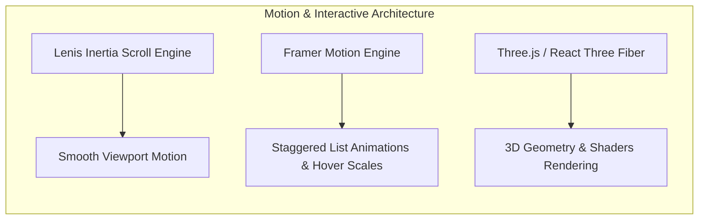

# 🎨 Design System & UI/UX Guidelines

## Project Name: Harshit Developer Portfolio
**Version:** 1.0.0  
**Design Paradigm:** OLED-First Dark Mode | Modern Glassmorphism | 3D WebGL Immersion | Micro-Interactions  
**Document Status:** Active / Production  

---

## 1. Design Philosophy & Rationale

The design system of the **Harshit Developer Portfolio** is built around three core principles:

1. **Aesthetic Impact with High Performance:** Delivering a memorable visual experience using 3D WebGL graphics and smooth scroll inertia without degrading Core Web Vitals or CPU performance.
2. **OLED-First Dark Mode & Glassmorphic Depth:** Employing deep dark backgrounds (`#0a0a0f`), vibrant neon primary accents (`#22c55e`), subtle borders (`#1e293b`), and backdrop blur cards to establish visual hierarchy.
3. **Clean Developer Typography:** Utilizing modern, clean typography pairing (**Archivo** + **Space Grotesk** + **JetBrains Mono**) to make project descriptions and technical skills highly readable.

---

## 2. Typography System

The typography hierarchy uses three curated Google Fonts imported via CSS `@import`:

```css
@import url('https://fonts.googleapis.com/css2?family=Archivo:wght@300;400;500;600;700;800&family=JetBrains+Mono:wght@400;500;600&family=Space+Grotesk:wght@400;500;600;700&display=swap');
```

| Font Token | Font Family | Usage | Fallback |
|---|---|---|---|
| `--font-heading` | **Archivo** | Section Titles, Hero Headings, Modal Headers | `sans-serif` |
| `--font-body` | **Space Grotesk** | Paragraphs, Subtitles, Project Descriptions | `sans-serif` |
| `--font-mono` | **JetBrains Mono** | Code Blocks, Tech Stack Badges, Terminal Text | `monospace` |

---

## 3. Color Palette & Design Tokens

Theme tokens are defined using **Tailwind CSS v4** `@theme` specification with `@custom-variant dark`:

```css
@theme {
  /* Light Mode Tokens */
  --color-background: #fafafa;
  --color-foreground: #0f172a;
  --color-card: #ffffff;
  --color-card-foreground: #0f172a;
  --color-primary: #16a34a;      /* Emerald Green */
  --color-accent: #0ea5e9;       /* Sky Blue */
  --color-muted: #f1f5f9;
  --color-border: #e2e8f0;
  --color-ring: #16a34a;

  /* Border Radii */
  --radius-sm: 0.25rem;
  --radius-md: 0.375rem;
  --radius-lg: 0.5rem;
  --radius-xl: 0.75rem;
  --radius-2xl: 1rem;
}

/* Dark Mode Overrides (OLED-First) */
.dark {
  --color-background: #0a0a0f;   /* Deep OLED Black */
  --color-foreground: #f1f5f9;
  --color-card: #111118;         /* Glass Card Dark */
  --color-card-foreground: #f1f5f9;
  --color-primary: #22c55e;      /* Neon Emerald */
  --color-accent: #38bdf8;       /* Vibrant Sky Blue */
  --color-muted: #1a1a24;
  --color-border: #1e293b;
  --color-ring: #22c55e;
}
```

### Color Token Palette Matrix

| Token Name | Light Mode Hex | Dark Mode Hex | Primary Usage |
|---|---|---|---|
| `--color-background` | `#fafafa` | `#0a0a0f` | Main page background |
| `--color-foreground` | `#0f172a` | `#f1f5f9` | Primary body text |
| `--color-card` | `#ffffff` | `#111118` | Project cards, modal containers |
| `--color-primary` | `#16a34a` | `#22c55e` | Primary CTA buttons, active links, glow highlights |
| `--color-accent` | `#0ea5e9` | `#38bdf8` | Tech badges, secondary highlights, links |
| `--color-border` | `#e2e8f0` | `#1e293b` | Card borders, dividers, inputs |
| `--color-muted` | `#f1f5f9` | `#1a1a24` | Tag pills, neutral background blocks |

---

## 4. 3D WebGL Canvas & Motion Guidelines



### 4.1 3D WebGL Canvas
- **Rendering Engine:** Powered by Three.js (`@react-three/fiber`, `@react-three/drei`, `ogl`).
- **Dynamic Import:** Dynamic loading with `{ ssr: false }` to prevent SSR hydration errors and improve page speed.
- **Fallbacks:** Render subtle SVG mesh background on low-power devices or devices with WebGL disabled.

### 4.2 Motion & Animation Principles
- **Smooth Inertia Scrolling:** `lenis` handles smooth scrolling with customizable damping (`lerp: 0.1`).
- **Micro-Interactions:** Buttons and Project Cards incorporate subtle hover elevation (`scale: 1.02`), glow shadows, and smooth opacity transitions (`duration: 0.2s`).
- **Scroll-Triggered Reveals:** Sections animate into view using Framer Motion `whileInView` with staggered children arrays.

---

## 5. UI Component Design Specifications

### 5.1 Project Cards
- **Container:** Glassmorphic background (`bg-card/80 backdrop-blur-md border border-border/50`).
- **Border Radius:** `--radius-xl` (12px).
- **Hover State:** Translate-Y elevation (`-4px`) paired with primary glow border highlight (`border-primary/50`).
- **Tech Stack Badges:** Pill-shaped (`rounded-full`), font `JetBrains Mono`, background `bg-muted`, text `text-accent`.

### 5.2 Interactive Contact Form
- **Form Inputs:** Dark/Light border transition (`border-border focus:border-ring focus:ring-1 focus:ring-ring`).
- **Validation Messages:** Red destructive text (`text-destructive`) rendered underneath invalid input fields.
- **Submitting State:** Disabled state with loading spinner overlay and button opacity reduction.
- **Toast Notifications:** Styled using `sonner` with custom dark theme matches.

---

## 6. Accessibility (a11y) & Responsiveness

- **WCAG 2.1 AA Compliance:** Text-to-background contrast ratios strictly exceed 4.5:1 for standard body text and 3:1 for large headings.
- **Focus Rings:** Visible ring indicators (`focus-visible:ring-2 focus-visible:ring-ring`) for keyboard navigation accessibility.
- **Responsive Breakpoints:** Fully responsive across standard mobile (320px+), tablet (768px+), desktop (1024px+), and ultra-wide displays (1440px+).

---

## 7. Summary & Repository Inclusion Guidance

> **Should `design.md` be pushed to GitHub?**  
> **Yes, absolutely!** Pushing a `design.md` file to your GitHub repository demonstrates **strong UI/UX design taste, design system engineering, and attention to visual detail**. It shows recruiters and lead frontend engineers that you build applications with intentional, beautiful design systems.
